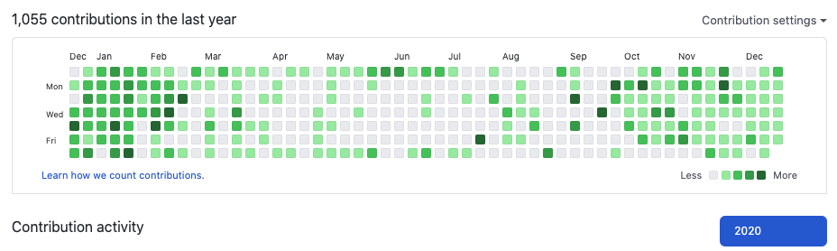

### 그때의 나는 그게 옳은 선택이라고 생각했고 지금의 나는 그 결과를 얻은 것 뿐이다.
 
 

평범한 삶을 살아온 다른 사람들의 입장에서 나의 인생을 바라본다면 평범하지 않고 굴곡진 삶의 연속이었지만, 
이번년도는 모두에게 평범하지 않고 굴곡진 삶이 강제된 한 해가 아닌가 싶다.
  
연초에 갑자기 터진 코로나라는 Pandemic은 취업시장을 얼어붙게 만들었고,  
작년 말에 회사가 망하면서 실업급여를 받으며 열심히 공부중이던 나는, 하던 공부를 접고 급하게 취업시장에 뛰어들어 계획했던 것만큼 공부량을 달성하지 못하고 취업을 한다.
  
취업 후 내가 한 일은 웹으로 하이브리드 앱을 만들어서 앱스플라이어를 적용하고, unity 기반 게임에서 쓰는 모듈을 만드는 등 여태껏 해보지 않은 영역에 대한 도전의 연속이었다. 
최종적으로는 전혀 공부해본적 없던 React Native로 한번도 해보지 않은 영역인 앱개발을 당장 해야되는 상황에 처했고, 일정상 R&D 할 시간을 전혀 주지 않아서 새벽출근과 철야를 통해 학습과 개발을 동시에 병행해서 결국 내 역할을 훌륭히 해냈다.(시킨 회사나 시킨다고 진짜로 해낸 본인이나 둘다 제정신은 아닌것 같다. 하하) 
이번 회사에서 해보지 않았던 것을 완성해내는 경험과 결과를 얻으니 '내가 드디어 주니어 개발자에서 시니어 개발자로 넘어갈수 있는 진입점에 도달했구나.'라는 확신이 처음으로 들면서 더 공부를 열심히 하게 되었던 것 같다.
  
이번년도에 소화해낸 공부량에는 개인적으로 만족했다. 
크런치 모드에 연이은 야근에도 불구하고 아침 7시까지 출근해서 공부하는 버릇을 들인 덕분에 꾸준히 일정량의 공부를 소화해냈다. 
중간에 React Native를 갑자기 해야되는 상황때문에 개인공부가 아닌 React Native에 시간을 많이 할애했다는 것이 아쉽다. 
그래도 이번에 앱을 개발해보며 단순히 '웹 프론트' 개발자가 아니라 '프론트' 개발자로써 한단계 성장하는 계기가 되지 않았나란 생각에 위안을 얻는다.
  
연초부터 중순까지 전에 스프링학원 다니던 동생 두명과 같이 까페에서 스터디를 했지만, 점점 더 심해지는 코로나때문에 결국 중단했다. 
전에 하던 수요모각코 주요 멤버들이 다시 만든 오프라인 스터디에 가입했지만, 코로나때문에 온라인으로 진행하게 되었다. 
그리고 전에 스프링학원 다니던 다른 동생과 자료구조 스터디를 온라인으로 시작했다. 
코로나라서 공부를 못했다는 핑계를 대고 싶지 않아서 어떻게 해서든 더 하려고 노력했던 것 같아 스스로에게 박수를 쳐주고 싶다.
  
Dan Abramov의 블로그에 가면 아래와 같은 글이 있다. 
Experienced developers have valuable expertise despite knowledge gaps. 
I’m aware of my knowledge gaps (at least, some of them). I can fill them in later if I become curious or if I need them for a project.
  
안드로이드, IOS앱 한번 만들어 본적 없고 React Native 또한 한번도 해본적 없는 앱을 개발 할 수 있었던 이유는, 리액트에 대한 이해와 UI 렌더링에 원초적인 이해가 있었기 때문이라고 생각한다. 어짜피 핵심적인 것에 대한 깊은 이해만 있으면 필요한 것들을 API Document과 검색을 통해서 그때그때 익혀가며 해낼 수 있기 때문이다. 
GraphQL이니 하는 당장 회사에서 쓰지 않는 기술에 관심을 기울이기 보다 최근 자료구조 스터디를 시작한 이유도 바로 이것이다. 
핵심적인 것에 좀 더 집중해서 나중에 필요한 게 있으면 바로 익히고 응용해서 써먹을 수 있게 하려 함이다.
  
이전 2년정도는 좋게 말하면 풀스택 나쁘게 말하면 잡부 개발자로 살아왔지만, 이번년도부터는 프론트엔드 개발자로써 전문성을 높히는 것에 치중하려고 한다.
  
다시 도전이다 2021년.

 
 

### Best of 2020

- Book: 나는 단순하게 살기로 했다
- Record: i`m so tired... -Lauv, Troye Sivan
- Movie: 날씨의 아이
- Lecture: 인프런의 실전 리액트 프로그래밍
- Item: Macbook Pro
- Tool: Notion
- 자세한 내용은 https://github.com/ds2lvg/devDiary/blob/master/best/2020.md

### Commit in 2020

  

### My programing language in 2020

- if(Math.round(Markdown) === 20) result\["개인공부량"\] = 전체 타이핑의 5분의 1
- 3월까지는 백수 상태로 공부만 함 && 방통대 3학년 편입 result\["언어그래프"\] = 다양한 프로그래밍 언어가 포함된 이유

### 2020년 주간 회고

- [2020_12_5th](./2020_12_5th.md)
- [2020_12_4th](./2020_12_4th.md)
- [2020_12_3th](./2020_12_3th.md)
- [2020_12_2th](./2020_12_2th.md)
- [2020_12_1th](./2020_12_1th.md)
- [2020_11_5th](./2020_11_5th.md)
- [2020_11_4th](./2020_11_4th.md)
- [2020_11_3th](./2020_11_3th.md)
- [2020_11_2th](./2020_11_2th.md)
- [2020_11_1th](./2020_11_1th.md)
- [2020_10_4th](./2020_10_4th.md)
- [2020_10_3th](./2020_10_3th.md)
- [2020_10_2th](./2020_10_2th.md)
- [2020_10_1th](./2020_10_1th.md)
- [2020_09_4th](./2020_09_4th.md)
- [2020_09_3th](./2020_09_3th.md)
- [2020_09_2th](./2020_09_2th.md)
- [2020_09_1th](./2020_09_1th.md)
- [2020_08_4th](./2020_08_4th.md)
- [2020_08_3th](./2020_08_3th.md)
- [2020_08_2th](./2020_08_2th.md)
- [2020_08_1th](./2020_08_1th.md)
- [2020_07_4th](./2020_07_4th.md)
- [2020_07_3th](./2020_07_3th.md)
- [2020_07_2th](./2020_07_2th.md)
- [2020_07_1th](./2020_07_1th.md)
- [2020_06_4th](./2020_06_4th.md)
- [2020_06_3th](./2020_06_3th.md)
- [2020_06_2th](./2020_06_2th.md)
- [2020_06_1th](./2020_06_1th.md)
- [2020_05_4th](./2020_05_4th.md)
- [2020_05_3th](./2020_05_3th.md)
- [2020_05_2th](./2020_05_2th.md)
- [2020_05_1th](./2020_05_1th.md)
- [2020_04_5th](./2020_04_5th.md)
- [2020_04_4th](./2020_04_4th.md)
- [2020_04_3th](./2020_04_3th.md)
- [2020_04_2th](./2020_04_2th.md)
- [2020_04_1th](./2020_04_1th.md)
- [2020_03_4th](./2020_03_4th.md)
- [2020_03_3th](./2020_03_3th.md)
- [2020_03_2th](./2020_03_2th.md)
- [2020_03_1th](./2020_03_1th.md)
- [2020_02_4th](./2020_02_4th.md)
- [2020_02_3th](./2020_02_3th.md)
- [2020_02_2th](./2020_02_2th.md)
- [2020_02_1th](./2020_02_1th.md)
- [2020_01_5th](./2020_01_5th.md)
- [2020_01_4th](./2020_01_4th.md)
- [2020_01_3th](./2020_01_3th.md)
- [2020_01_2th](./2020_01_2th.md)
- [2020_01_1th](./2020_01_1th.md)